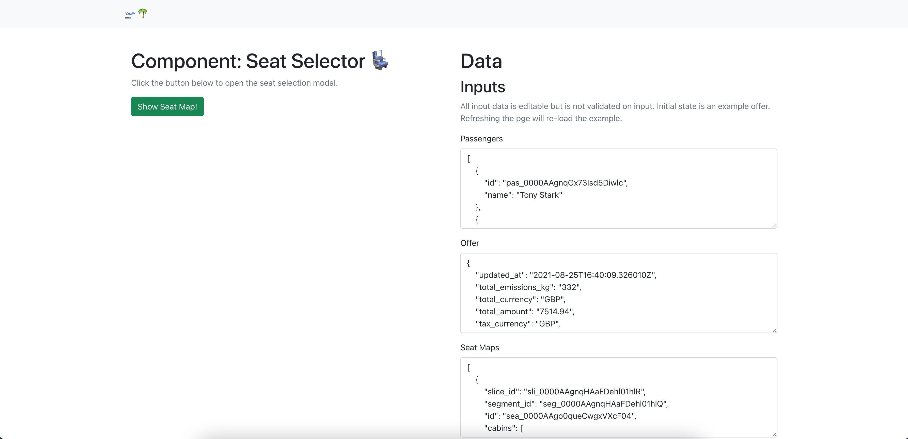
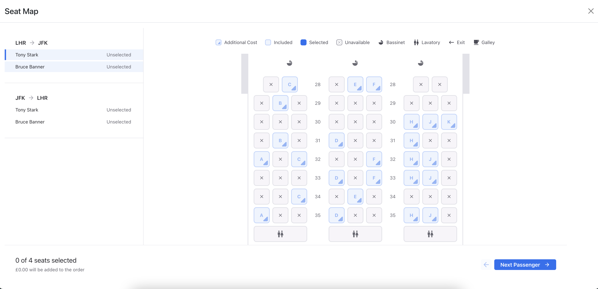

# Duffel Seat Selection Component Example

A React app containing example usage of the [Duffel Seat Selector Component](https://www.npmjs.com/package/@duffel/components).

## Getting Started

To run this project you will need `npm` installed on your machine.

Installation:

```npm install```

Run:

```npm start```

## What To Expect

The home page will load with a default example. You can change the inputted data by updating the text fields and this will then be reflected in the `SeatMap` component.

Data output by the compnent will be available in the final text field.



Pressing the 'Show Seat Map!' button displays the fully interactive `SeatMap` component in a modal.

